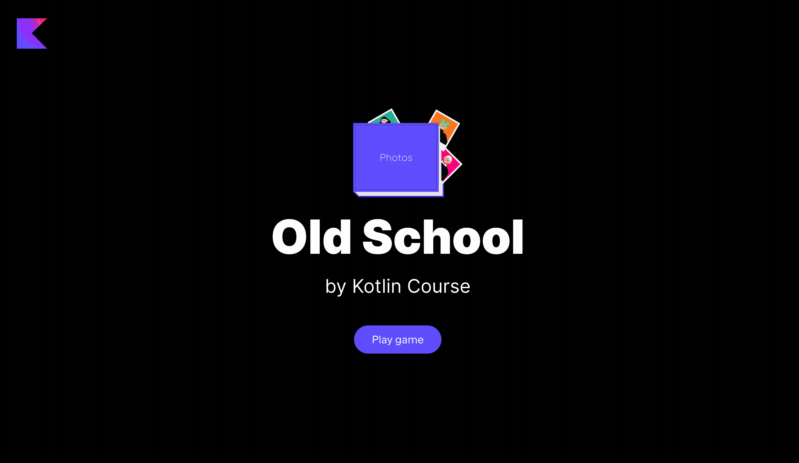

[](https://confluence.jetbrains.com/display/ALL/JetBrains+on+GitHub)
[](https://github.com/jetbrains-academy/kotlin-onboarding-part3/actions/workflows/gradle-build.yml)
[](https://github.com/jetbrains-academy/kotlin-onboarding-part3/actions/workflows/gradle-build-with-detekt.yml)
[](https://opensource.org/licenses/MIT)

# Kotlin Onboarding: Collections

This course is designed for novices in Kotlin and focuses on working with collections in the Kotlin language.
This is the third module of the course, the [first]((https://plugins.jetbrains.com/plugin/21067-kotlin-onboarding--introduction) and [second](https://plugins.jetbrains.com/plugin/21913-kotlin-onboarding-object-oriented-programming) modules can be found on JetBrains Marketplace.
This module assumes that you are already familiar with all the constructs discussed in the first and second parts.

Each lesson of the course is built in the form of a project: step by step, by completing different small tasks,
you will get a fully working project in the end. Some of the projects are practice-based and introduce to you
different helpful Kotlin functions though practical exercises without much theory part.

Note that this course does not provide a detailed explanation of such aspects as asymptotic complexity, 
mostly, it just describes the definitions of different types of collections and shows how to use them in Kotlin.

All topics will be accompanied by links to [the official Kotlin documentation](https://kotlinlang.org/docs/home.html), which you can read later.

Topics covered:

- definitions of `List`, `Set`, and `Map` collections;
- read-only and mutable collections with `add` and `remove` operations;
- built-in functions to work with `List`, `Set`, and `Map`;
- FIFO (First-In-First-Out) approach and how to work with in Kotlin;
- LIFO (Last-In-First-Out) approach and how to work with in Kotlin;
- **[will be available later]** aggregation operations;
- **[will be available later]** sequences.

After this course, you will be ready to use Kotlin collections in efficient ways.

## Technical requirements

Before starting this course, check the following requirements.

1. Your computer needs to have a stable internet connection.
2. Git version control system needs to be installed on your computer (link to the git site: https://git-scm.com/).
3. Make sure that the path to the root folder of the course does not contain spaces, special characters, or non-Latin characters.
4. Make sure that you use the [Intellij IDEA](https://www.jetbrains.com/idea/download/?_ga=2.189310830.494255415.1682514714-1823138827.1669894241&_gac=1.83806948.1682684894.Cj0KCQjw3a2iBhCFARIsAD4jQB3QkDU43KtbIx2HzEz02KvcN7Ma3QGzkIbyX4KS3H4x8b2bl9p4EfYaAvWsEALw_wcB&_gl=1*1h13lr8*_ga*MTgyMzEzODgyNy4xNjY5ODk0MjQx*_ga_9J976DJZ68*MTY4MjY5NDIyMy4xMjUuMS4xNjgyNjk0MjM4LjQ1LjAuMA..#section=windows) with version at least `2023.1.1`.
5. Make sure that you use the [EduTools](https://plugins.jetbrains.com/plugin/10081-jetbrains-academy/versions/stable/405578) plugin with version at least `2023.9-2023.1-1603`.
6. To be able to run web applications, you need to have a web browser. We recommend using [Google Chrome](https://www.google.com/chrome/).

The course is integrated into the [Intellij Idea IDE](https://www.jetbrains.com/idea/), which has a free Community license.
You can use this license to complete the course.
If you have some troubles with the course installation, feel free to contact us by email at education@jetbrains.com.

## Course projects

This module is dedicated to the creation web applications on the topic _Next to the future_.
It means that in each lesson, you will create a web application with 
some images familiar from your (or your parents') childhood. 

The current version of the course covers three web-applications, two more will be released later:

1) **Duck shop**. As you know, many programmers ask rubber ducks for help.
   The main goal of this project is to implement a shop window with rubber duckies
   and study `List`, `Set`, and `Map` collections.

<details>
<summary>Example of ready application</summary>


</details>

2) **Old school**. Nowadays, taking Polaroid photos is often a hobby,
   and most photos are stored electronically.
   In the past, however, this was an almost inappropriate way to preserve
   the memory of important moments.
   The main goal of this project is to go back in time and
   implement several `List`, `Set`, and `Map` functions that allow you to navigate through your photo album.

<details>
<summary>Example of ready application</summary>


</details>

3) **Tamagotchi**. This toy was once very popular - a small keychain device that lets you take care of a virtual pet.
   In our case, we will be looking after a little corgi called Andy.
   The main goal of this project is to go back in time and
   study two very important approaches in programming - FIFO and LIFO.

<details>
<summary>Example of ready application</summary>


</details>

## Getting started

This course is available on JetBrains Marketplace and can be installed from the
[IntelliJ IDEA](https://www.jetbrains.com/idea/) IDE directly, but you can also use it in
the Course Creator mode or create a course archive from the source code.

### Getting started: create a course preview from the source code

You can create a [course preview](https://plugins.jetbrains.com/plugin/10081-edutools/docs/educator-start-guide.html#preview_course) from the source code:
1. Clone the repository:
```text
git clone https://github.com/jetbrains-academy/kotlin-onboarding-part3.git
```

2. Install [npm](https://www.npmjs.com/) and [yarn](https://yarnpkg.com/) on your computer.

3. Run yarn install in each module with frontend.

4. Build the project:
```text
./gradlew build
```

3. Install the [EduTools](https://plugins.jetbrains.com/plugin/10081-edutools/docs/educational-products.html) plugin from JetBrains Marketplace.

4. Create a new [course preview](https://plugins.jetbrains.com/plugin/10081-edutools/docs/educator-start-guide.html#preview_course).

### Getting started: create a course archive

You can create a [course archive](https://plugins.jetbrains.com/plugin/10081-edutools/docs/educator-start-guide.html#fe7010f2) from the source code:
1. Clone the repository:
```text
git clone https://github.com/jetbrains-academy/kotlin-onboarding-part3.git
```

2. Build the project:
```text
./gradlew build
```

3. Install the [EduTools](https://plugins.jetbrains.com/plugin/10081-edutools/docs/educational-products.html) plugin from JetBrains Marketplace.

4. Create a new [course archive](https://plugins.jetbrains.com/plugin/10081-edutools/docs/educator-start-guide.html#fe7010f2).

## Run tests

To run tests locally, you just need to build the project and run the following command:

```text
./gradlew test
```

The tests use the Java Reflection API under the hood to check the user's tasks.

## Want to know more?

If you have questions about the course or the tasks or if you find some errors,
you can ask questions and participate in discussions in repository [issues](https://github.com/jetbrains-academy/kotlin-onboarding-part3/issues).

## Contribution

Please be sure to review the [project's contributing guidelines](./contributing.md) to learn how to help the project.
